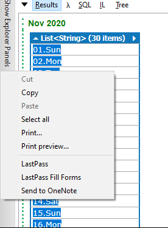

# Overview
Produces the list of days for creating the Bullet Journal days of the month list for OneNote.

# Usage
1. Run the script, select the output, and copy the results list.
Image of the output

1. Paste into the bottom of the new Bujo OneNote page.

1. Delete the "List`<String`>" header row. 

1. Right click the table created for the days of the month and insert the column to the right. Then adjust the right column width.

# Notes
The script default to the next month.  Comment out the ".AddMonth" line to get the current.